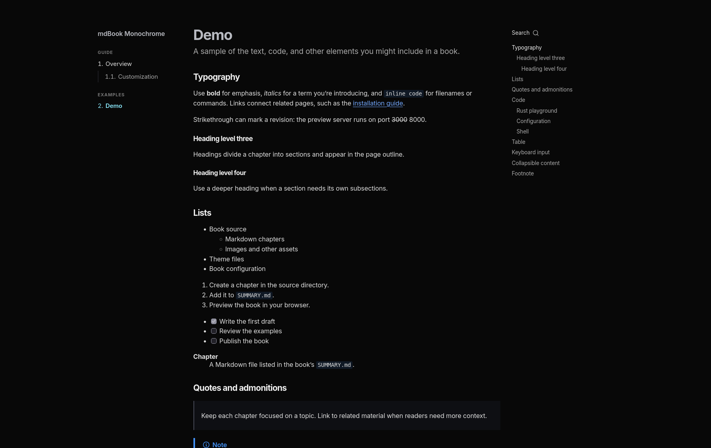
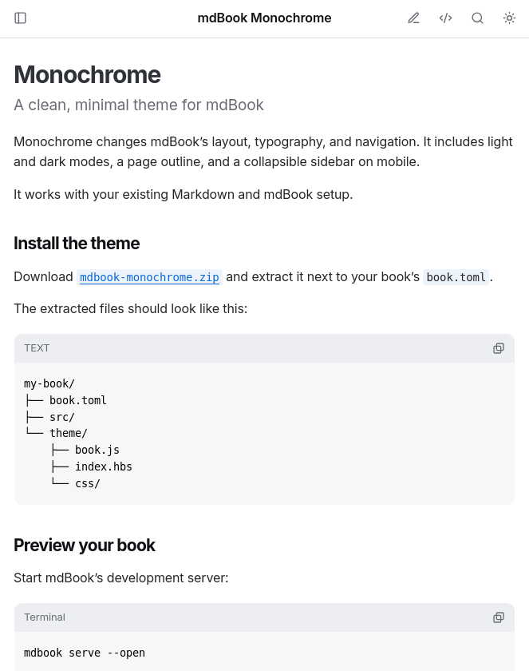

# mdBook Monochrome

A clean, monochrome design for mdBook, with a new page layout, typography, and navigation.

[View the demo site](https://mdbook-monochrome.dawdle.space).

<table>
  <tr>
    <td align="center"></td>
    <td align="center"></td>
  </tr>
</table>

## License

Licensed under either the [Apache License, Version 2.0](LICENSE-APACHE) or the [MIT license](LICENSE-MIT), at your option.
